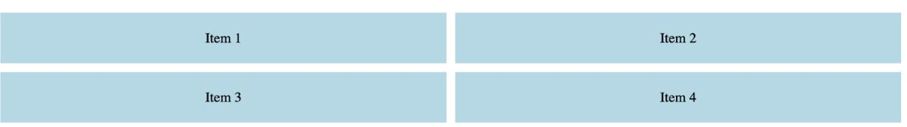
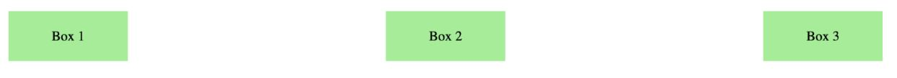
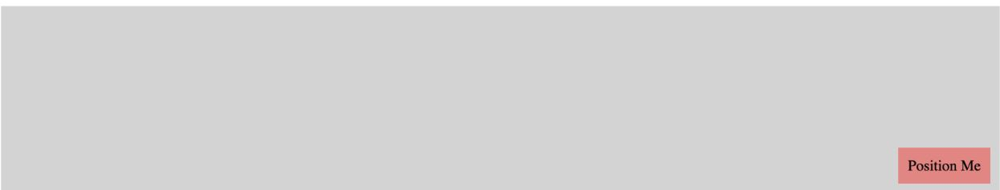
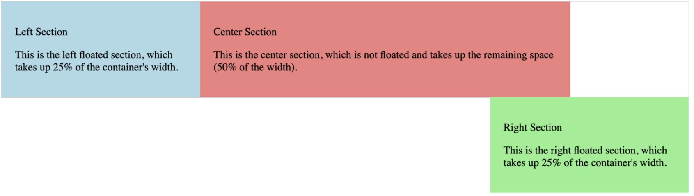

# CS 5610

## Lab 3: CSS and JS

### Part 1 - CSS Layout

**Objective:** To help you understand and apply fundamental CSS layout techniques.

Click on the provided GitHub classroom link: [GitHub Classroom Link](https://classroom.github.com/a/mXKvnqJe)

1. Clone the repository  
2. Inside your cloned repository, locate the starter HTML file.  
3. Open the file in your code editor.  
4. Create a `style.css` file in the same folder as your HTML file.  

Follow the instructions in the assignment to write CSS for:

- Grid Layout
- Flexbox Layout
- Positioned Elements
- Float Layout

### Grid Layout

1. Create a 2x2 grid layout using the `display: grid` property. Ensure each grid item takes up equal space in the two-column layout.  
2. Add 10px of space between grid items using the `grid-gap` property.  
3. Set the grid container's margin to 20px.  
4. Style each grid item with a light blue background, 20px padding, and centered text.

**Output:**

---

### Flexbox Layout

1. Create a flexbox layout using the `display: flex` property. Ensure that the items are arranged in a row.  
2. Evenly space the items across the row.  
3. Set the flex container's margin to 20px.  
4. Style each item with a light green background, 20px padding, and centered text. Set the width of each item to 100px to control the size.

**Output:**

---

### Positioned Element

1. Set the `.positioned-container` to use relative positioning and give it a height of 200px and a light grey background.  
2. Use absolute positioning on the `.positioned-element` to place it 10px from the bottom and 10px from the right.  
3. Style the positioned element with a lightcoral background and 10px padding.

**Output:**

---

### Float Layout

**For `.float-left`:**

1. Use `float: left` to position it on the left side of the container.  
2. Set its width to 25% of the container's width so it occupies a quarter of the space.  
3. Apply a `background-color` of lightblue to visually distinguish it.  
4. Add `padding: 20px` to create space inside the element.

**For the `.center-section`:**

1. Not floated  
2. Set the width to 50% so it takes up half of the container's width.  
3. Use `display: inline-block` to make sure the center section aligns horizontally next to the floated sections.  
4. Apply `vertical-align: top` to align the top of the center section with the floated left and right sections.  
5. Set a `background-color` of lightcoral for distinction.  
6. Add `padding: 20px` to create space inside the center section.

**For `.float-right`:**

1. Use `float: right` to position it on the right side of the container.  
2. Set its width to 25% to match the left section.  
3. Apply a `background-color` of lightgreen to visually distinguish it.  
4. Add `padding: 20px` to create space inside the element.

**For the `.float-container`:**

1. Add `margin: 20px` to create space around the container.  
2. Apply a border (`1px solid #ccc`) to visually separate and outline the container.

**Output:**

